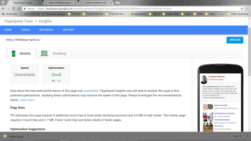

## Website Performance Optimization portfolio project

Your challenge, if you wish to accept it (and we sure hope you will), is to optimize this online portfolio for speed! In particular, optimize the critical rendering path and make this page render as quickly as possible by applying the techniques you've picked up in the [Critical Rendering Path course](https://www.udacity.com/course/ud884).

To get started, check out the repository and inspect the code.

### Getting started

#### Part 1: Optimize PageSpeed Insights score for index.html

Some useful tips to help you get started:

1. Check out the repository
1. To inspect the site on your phone, you can run a local server

  ```bash
  $> cd /path/to/your-project-folder
  $> python -m SimpleHTTPServer 8080
  ```

1. Open a browser and visit localhost:8080
1. Download and install [ngrok](https://ngrok.com/) to the top-level of your project directory to make your local server accessible remotely.

  ``` bash
  $> cd /path/to/your-project-folder
  $> ./ngrok http 8080
  ```

1. Copy the public URL ngrok gives you and try running it through PageSpeed Insights! Optional: [More on integrating ngrok, Grunt and PageSpeed.](http://www.jamescryer.com/2014/06/12/grunt-pagespeed-and-ngrok-locally-testing/)

Profile, optimize, measure... and then lather, rinse, and repeat. Good luck!

## My Optimizations (Part 1):

1. Put all blocking CSS and scripts at the bottom of the index.html.

        <link href="css/style.css" rel="stylesheet">

2. Concatenated the print.css file with the styles.css file:
  
        <!--    <link href="css/print.css" rel="stylesheet"> concatenated in style.css-->
3. Put `async` on main.js to avoid render blocking js: 

                <script async src="js/perfmatters.js"></script>

4. Removed the webfonts link completely. Fonts are still acceptable. 
TODO: Find another way to import fonts without lowering pageSpeed scores.

5. Optimized personal profile picture and Cam's pizzeria picture using [tinyjpg.com](https://tinyjpg.com) and by rescaling with Gimp. The size of the ```pizzeria.img``` went from over 2 MB to 7 KB. It is renamed ```pizzeria-min-scaled.jpg```.

6. Latest run on PageSpeed Insights gave a mobile score of 99 (and a desktop of 93).

    


#### Part 2: Optimize Frames per Second in pizza.html

To optimize views/pizza.html, you will need to modify views/js/main.js until your frames per second rate is 60 fps or higher. You will find instructive comments in main.js. 

You might find the FPS Counter/HUD Display useful in Chrome developer tools described here: [Chrome Dev Tools tips-and-tricks](https://developer.chrome.com/devtools/docs/tips-and-tricks).

## My Optimizations (Part 2):

### a. Scrolling to achieve 60 fps or greater:

On scrolling the most notable performance bottleneck was the ```updatePositions()``` function. The basic plan of attack was to remove unecessary cycles and decrease file sizes.
1. took ```scrollTop = .... / 1250``` out of the for loop as it is a constant at call time and doesn't need to be called repeatedly.
    
2. changed
    ``` var items = document.querySelectorAll('.mover'); ```
to an array called movers and used the more efficient ```getElementsByClassName``` method:
``` var movers = document.getElementsByClassName('mover');```

3. the sliding pizzas created on loading the page were originally 200. I noticed at maximum screen width there would be a possible total of 3 rows by 8 columns. In the for loop of the ```addEventListener``` function I changed ```i``` from 200 to 24.
```for (var i = 0; i < 24; i++)```
TODO: Figure a way to automatically adjust the number of pizzas provided for different screen sizes.
4. the ```pizza.png``` file which represents the moving pizzas was originally 49 KB. I minimized this to 19 KB, again using [tinyjpg.com](http://tinyjpg.com)
5. the main ```pizzeria.jpg``` file at the top of the page was also set upon for a size loss. The same method was used as above and the size went down from 2079 KB to 270 KB. It was renamed ```pizzeria-min.jpg```. Needless to say, this considerably reduced first page load time.
6. put ```getAnimationFrame``` around ```updatePositions()``` on loading the page. This showed a slight improvement as it removed the ```layout``` portion on the timeline.
7. used ```will-change: transform``` on the ```.mover``` in the css file. This changed the mover pizzas to another layer when scrolling.
8. in ```updatePositons``` used transforms to remove painting from the critical path: ````movers[i].style.transform = "translateX(" + (phaseArray[i % 5]) + "px)";````
Also changed the  ```.basicWidth``` property to ```.left``` because the transform method would relate to the orignal ```.left``` property for calculations.

9.  set the number of moving pizza elements to be created on loading to fit the screen size.
                ```var cols = screen.width / 250;```
                ```var rows = screen.height / 225;```
                ```var PizzaOrderSize = Math.floor(rows * cols);```

    TODO: this could be modified to recalcuate on window resizing
    
10. created an independent array ```phaseArray``` outside of the main for loop:
  ```var phaseArray = [];```
    ```for (var i = 0; i < 5; i++) {```
    ```phaseArray[i] = Math.sin((scrollTop) + (i % 5)) * 100;}```

    This was supposed to make less calculations, only 5,  and enhance performance. I did not notice a great improvement. Calling the array from inside the next ``for`` loop for the position transform may be offsetting these gains.

11. lastly I put the files through an online minifier as I was still struggling with my gulpfile when minimizing css with the ```uglify()``` module.

### b. Sliding for different pizzas sizes in less than 5ms:

the first performance recording indicated that the ```determineDx``` function was a major bottleneck and causing 'Forced Reflow'errors. Inspecting the code it was seen that ```changePizzaSizes()``` was calling ```determineDx ``` in a loop and also recalculating the ```newwidth``` variable everytime. In addition it was using a ```querySelectorAll``` on multiple lines just to assign the ```newwidth``` to the array elements' ```style.width```

1. in ```changePizzaSizes()``` I removed the need to use multiple calls to the  ```querySelectorAll``` method by declaring an array called ```allPizzas``` that found its  elements by the ```getElementsByClassName``` method. 

2. looking at the repeated calls to ```determineDx``` it was noted that ```dx``` could be calculated using constants. Both ```windowWidth``` and ```offsetWidth``` moved to the top of the ```resizePizzas``` function to be called once per cycle. This reduced the time to resize pizzas from 270 ms approx. to  28 ms approx. No more forced flows were noted in the performance recordings.

3. it was noted that ```offsetWidth``` was at call time the same as ```oldWidth```. This eliminated the need for ```var oldWidth = elem.offsetWidth```declaration and a new line of code was written outside of the ```determineDx``` function: ```var oldSize = offsetWidth / windowWidth```.

4. at this point ```determineDx``` could be reduced to one simple calculation. The ```sizeSwitcher()``` function was left independent to pass the ```newSize``` and ```determineDx``` removed:

        var newSize = sizeSwitcher(size);   
        var dx = (newSize - oldSize) * windowWidth; 

    
5. a ```newWidth``` parameter was calculated using: 
    ```var newwidth = offsetWidth + dx) + 'px';``` and passed on to the ```changePizzaSizes()``` to resize the ```allPizzas``` array elements' width style.
This reduced time to resize pizzas to approx. 1.5 ms. 


## c. To make the project standout:
TODO: I started to write a ```gulpfile.js``` to improve speeds by minimizing css and js. I managed to get most of the work done and sent to a ```dist``` folder. However, I got errors when trying to minimize css and will have to work on this later. I did learn a lot and went through treehouse's [GULP COURSE](https://teamtreehouse.com/library/gulp-basics).


### Optimization Tips and Tricks
* [Optimizing Performance](https://developers.google.com/web/fundamentals/performance/ "web performance")
* [Analyzing the Critical Rendering Path](https://developers.google.com/web/fundamentals/performance/critical-rendering-path/analyzing-crp.html "analyzing crp")
* [Optimizing the Critical Rendering Path](https://developers.google.com/web/fundamentals/performance/critical-rendering-path/optimizing-critical-rendering-path.html "optimize the crp!")
* [Avoiding Rendering Blocking CSS](https://developers.google.com/web/fundamentals/performance/critical-rendering-path/render-blocking-css.html "render blocking css")
* [Optimizing JavaScript](https://developers.google.com/web/fundamentals/performance/critical-rendering-path/adding-interactivity-with-javascript.html "javascript")
* [Measuring with Navigation Timing](https://developers.google.com/web/fundamentals/performance/critical-rendering-path/measure-crp.html "nav timing api"). We didn't cover the Navigation Timing API in the first two lessons but it's an incredibly useful tool for automated page profiling. I highly recommend reading.
* <a href="https://developers.google.com/web/fundamentals/performance/optimizing-content-efficiency/eliminate-downloads.html">The fewer the downloads, the better</a>
* <a href="https://developers.google.com/web/fundamentals/performance/optimizing-content-efficiency/optimize-encoding-and-transfer.html">Reduce the size of text</a>
* <a href="https://developers.google.com/web/fundamentals/performance/optimizing-content-efficiency/image-optimization.html">Optimize images</a>
* <a href="https://developers.google.com/web/fundamentals/performance/optimizing-content-efficiency/http-caching.html">HTTP caching</a>

### Customization with Bootstrap
The portfolio was built on Twitter's <a href="http://getbootstrap.com/">Bootstrap</a> framework. All custom styles are in `dist/css/portfolio.css` in the portfolio repo.

* <a href="http://getbootstrap.com/css/">Bootstrap's CSS Classes</a>
* <a href="http://getbootstrap.com/components/">Bootstrap's Components</a>